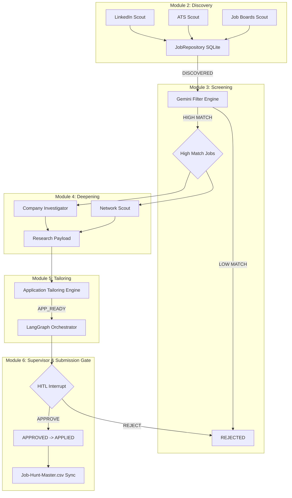

# Autonomous 6-Bot Job Hunting Department

An end-to-end, multi-agent automated job hunting pipeline powered by Google Gemini and LangGraph.

This project orchestrates 6 highly-specialized intelligent modules to automate the discovery, screening, research, tailoring, and final application gating of job postings.

## Architecture Diagram



## Key Features

- **Zero-Hallucination Screening**: Employs Gemini 3.1 Pro with strict guardrails and JSON schema verification to accurately map job requirements against candidate ground truth.
- **Search Grounding**: The Deepening Engine utilizes Google Search Grounding to pull real-time business context and network contacts directly into candidate briefings.
- **Deterministic Application Tailoring**: Produces precise, traceable diffs for your CV and writes bespoke cover letters guaranteed to adhere to your real experience.
- **Fail-Safe Human-in-the-Loop (HITL)**: LangGraph state checkpointing guarantees that no application is sent without explicit, unskippable human approval at the `interrupt()` gate.
- **Robust Concurrency & Persistence**: Relies on thread-safe SQLite WAL architecture to handle asynchronous multi-stream scraping and pipeline states.

## Directory Structure

```text
job_hunter/
├── api/                        # FastAPI Backend endpoints
├── frontend/                   # React + Vite Interactive Web Dashboard
├── database.py                 # SQLite WAL Persistence & CSV Exporter (Module 1)
├── schemas.py                  # Pydantic Data Contracts (Module 1)
├── master_cv_template.json     # Candidate Ground Truth
├── Job-Hunt-Master.csv         # Spreadsheet output for analysis
├── scouts/                     # 5-Stream Discovery Engine (Module 2)
├── filter/                     # Grounded Screening Engine (Module 3)
├── investigator/               # Parallel Deepening Engine (Module 4)
├── tailor/                     # Application Tailoring Engine (Module 5)
├── orchestrator/               # Supervisor, HITL & Submission Gate (Module 6)
└── tests/                      # Unit & E2E Testing Suite
```

## Installation & Setup

1. **Clone the repository**
   ```bash
   git clone <repository_url>
   cd job_hunter
   ```

2. **Configure Environment Variables**
   Create a `.env` file in the root directory by copying the example:
   ```bash
   cp .env.example .env
   ```
   Open the `.env` file and add your Gemini API Key:
   ```env
   GEMINI_API_KEY="your_google_gemini_api_key_here"
   DEFAULT_MODEL_FAST=gemini-3.5-flash
   DEFAULT_MODEL_PRO=gemini-3.1-pro-preview
   ```

3. **Initialize the Candidate Profile**
   Edit `master_cv_template.json` to reflect your actual professional history. The system will never hallucinate skills outside of this document.

## Running the Application

The system uses a **FastAPI backend** and a **React (Vite) frontend**. You need to run both to use the web dashboard.

### 1. Start the Backend (FastAPI)
Open a terminal in the root directory and start the Uvicorn server:
```bash
uv run uvicorn main:app --reload
```
The backend will run on `http://127.0.0.1:8000`.

### 2. Start the Frontend (React Web Dashboard)
Open a *second* terminal, navigate to the `frontend` folder, and start the Vite dev server:
```bash
cd frontend
npm install
npm run dev
```
The interactive dashboard will open in your browser (usually `http://localhost:5173`). From there, you can:
- Start the Discovery Pipeline (Fast or Normal Lane)
- Watch live job discoveries in real-time
- Review and Approve tailored cover letters & resumes

## Rate Limiting & API Quotas
The system is heavily optimized to run on Google Gemini's **Free Tier**. 
- It uses `gemini-3.5-flash` for high-volume discovery and resume screening to save quota.
- It automatically paces API requests (waiting 15 seconds between calls) to strictly respect the **5 Requests Per Minute** limit. If you have a paid API key and want it to run faster, you can modify the `asyncio.sleep(15)` delays in the `engine.py` files.

## Running Tests

To run the isolated unit tests or the End-to-End Test Suite:
```bash
uv run python -m pytest tests/test_blackbox_e2e.py -v
```
