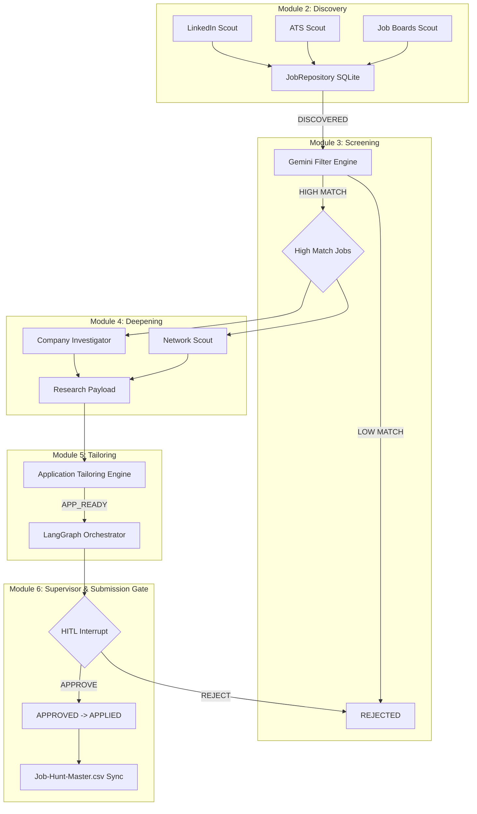

# Autonomous 6-Bot Job Hunting Department

An end-to-end, multi-agent automated job hunting pipeline powered by Google Gemini and LangGraph.

This project orchestrates 6 highly-specialized intelligent modules to automate the discovery, screening, research, tailoring, and final application gating of job postings.

## Architecture Diagram



## Key Features

- **Zero-Hallucination Screening**: Employs Gemini 3.1 Pro with strict guardrails and JSON schema verification to accurately map job requirements against candidate ground truth.
- **Search Grounding**: The Deepening Engine utilizes Google Search Grounding to pull real-time business context and network contacts directly into candidate briefings.
- **Deterministic Application Tailoring**: Produces precise, traceable diffs for your CV and writes bespoke cover letters guaranteed to adhere to your real experience.
- **Fail-Safe Human-in-the-Loop (HITL)**: LangGraph state checkpointing guarantees that no application is sent without explicit, unskippable human approval at the `interrupt()` gate.
- **Robust Concurrency & Persistence**: Relies on thread-safe SQLite WAL architecture to handle asynchronous multi-stream scraping and pipeline states.

## Directory Structure

```text
job_hunter/
├── database.py                 # SQLite WAL Persistence & CSV Exporter (Module 1)
├── schemas.py                  # Pydantic Data Contracts (Module 1)
├── master_cv_template.json     # Candidate Ground Truth
├── Job-Hunt-Master.csv         # Spreadsheet output for analysis
├── scouts/                     # 5-Stream Discovery Engine (Module 2)
├── filter/                     # Grounded Screening Engine (Module 3)
├── investigator/               # Parallel Deepening Engine (Module 4)
├── tailor/                     # Application Tailoring Engine (Module 5)
├── orchestrator/               # Supervisor, HITL & Submission Gate (Module 6)
│   ├── cli.py                  # Interactive rich Terminal Interface
│   ├── graph.py                # LangGraph StateGraph Definition
│   └── nodes.py                # Engine bindings to LangGraph
└── tests/
    ├── test_module_*.py        # Isolated unit tests for each module
    └── test_blackbox_e2e.py    # E2E deterministic system testing suite
```

## Installation & Quickstart

We recommend using `uv` for lightning-fast dependency management and execution, specifically sidestepping Windows execution alias issues.

1. **Clone and Setup**
   ```bash
   git clone <repository_url>
   cd job_hunter
   uv venv
   uv pip install -r requirements.txt # or manually install dependencies
   ```

2. **Configure API Keys**
   Ensure your Gemini API key is available in your environment:
   ```bash
   set GEMINI_API_KEY="your-api-key"
   ```

3. **Initialize the Candidate Profile**
   Edit `master_cv_template.json` to reflect your actual professional history. The system will never hallucinate skills outside of this document.

## Usage Modes

### Running the Interactive CLI
The primary method of engaging with the system is via the interactive `rich` terminal UI, which manages the Human-in-the-Loop pauses.

```bash
uv run python orchestrator/cli.py --lane fast_lane
```

### Exporting and Auditing
The pipeline continuously syncs its state to `Job-Hunt-Master.csv`. You can open this file in any spreadsheet software at any time to audit rejected jobs, monitor applied jobs, and review agent classifications.

## Running Tests

To run the isolated unit tests for the core modules:
```bash
uv run python -m pytest tests/test_module_1.py
# ... up to module 6
```

To run the comprehensive Black-Box End-to-End Test Suite:
```bash
uv run python -m pytest tests/test_blackbox_e2e.py -v
```
This suite verifies the golden path, negative path, filter disqualifications, zero-submission safety invariants, and idempotent re-ingestion constraints in a mocked, deterministic environment.
